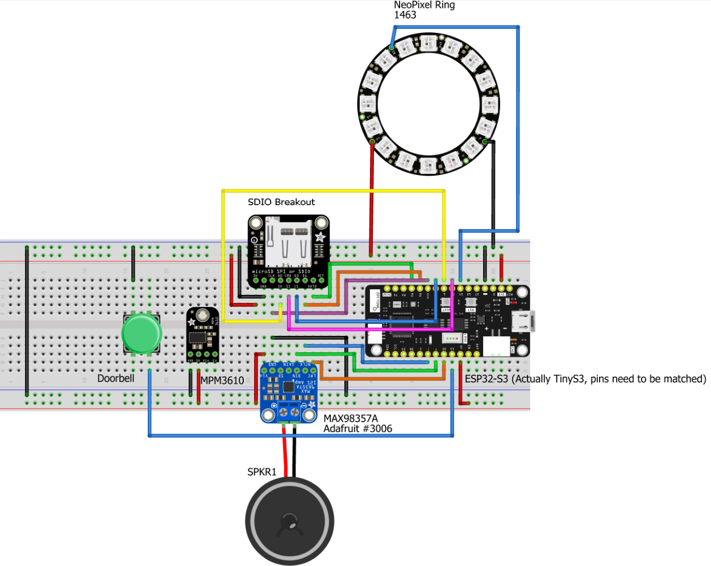

# The Ultimate Doorbell

# About

This project is intended as a flexible and customizable replacement for standard doorbell chimes. It uses common and inexpensive components, is fairly easy to build, and highly customizable through a convenient web interface.

## Features

# Requirements

These are the suggested requirements for this project, however customization is encouraged.

## Materials

This list was composed of materials that could all be sourced from a single store, Adafruit, thought any compatible substitutions should work. This list does not include common materials like jumper wires, protoboards, or soldering equipment.

* [TinyS3 - ESP32-S3](https://www.adafruit.com/product/5398)
* [Class D Amplifier Breakout - MAX98357A](https://www.adafruit.com/product/3006)
* [Speaker - 3" Diameter - 4 Ohm 3 Watt](https://www.adafruit.com/product/1314)
* [Micro SD SPI or SDIO Card Breakout](https://www.adafruit.com/product/4682)
* [Micro SD Card](https://www.adafruit.com/product/1294)
* [NeoPixel Ring - 16 x 5050](https://www.adafruit.com/product/1463)
* [MPM3610 5V Buck Converter](https://www.adafruit.com/product/4739)[^1]
* [2.1mm DC barrel jack](https://www.adafruit.com/product/610)[^1]
* [5V 2A Power Supply](https://www.adafruit.com/product/276)[^1]

[^1]: Not all of these are required, see the power supply requirements below

## Power Requirements

[!IMPORTANT]
Make sure you know what kind of power is available to you for your chime. The chime itself requires 5VDC, so your setup must be able to provide this.

Most household chimes in the United States use a 16VAC with a AC/AC transformer to bring the voltage down from the mains voltage. If this is the case, the safest option is to ignore/remove that transformer and use the 5V 2A supply and barrel jack from above and plug your doorbell into a standard outlet.

If you already have DC voltage available at the wall thats greater than 5V, you can use the MPM3610 from above to bring the voltage down to 5V.

# Assembly

## Hardware

You'll need to wire up the various components to the TinyS3 ESP32 microcontroller in the following manner.

[!IMPORTANT]
This setup assumes the doorbell button connects to GND. If this is not the case, you'll need to modify the code and replace the pull-up resistor setting with a pull-down resistor.

|TinyS3 Pin| Device Pin  | Device               |
|:---------|:-----------:|----------------------|
|1         |Data Input   |LED Ring              |
|5V        |5V DC        |                      |
|GND       |Ground       |                      |
|2         |button       |Doorbell Button       |
|8         |clk          |Micro SD Card Breakout|
|34        |cmd          |                      |
|9         |d0           |                      |
|37        |d1           |                      |
|35        |d2           |                      |
|36        |d3           |                      |
|3v3       |3V           |                      |
|GND       |GND          |                      |
|5         |I2S_BCLK     |MAX98357A             |
|4         |I2S_LRC      |                      |
|21        |I2S_DOUT     |                      |
|5V        |Vin          |                      |
|GND       |GND          |                      |
|5V        |5V out       |Power Supply          |
|GND       |GND          |                      |

[!TIP]
If you want to get maximum volume you can connect a [100 kΩ resistor](https://learn.adafruit.com/adafruit-max98357-i2s-class-d-mono-amp/pinouts#other-pins-2693325) from the amplifier's gain pin to 5V.

Below is an example diagram connecting to a Feather ESP32-S3 device.

[!WARNING]
This example does not match the current state of the code. Refer to the table above for the pin connections used in the code.



## Software

To program the doorbell chime for the first time follow the below directions. Subsequent updates can be applied using the [the web interface](#update-firmware) documented below.

1. First download [Visual Studio Code](https://code.visualstudio.com/).
2. Next, follow the instructions to [install PlatformIO](https://docs.platformio.org/en/latest/integration/ide/vscode.html#ide-vscode).
3. Clone or download this repository to a folder.
4. Open the project folder with PlatformIO in Visual Studio Code.
5. Connect the TinyS3 to the computer via USB.
6. Upload the code using the [PlatformIO toolbar](https://docs.platformio.org/en/latest/integration/ide/vscode.html#ide-vscode-toolbar).

## Web Interface

After the first flash you need to setup the web interface. There are two ways to do this:
1. Copy the contents of the `www` folder to the SD card

Or if you can't access the SD card

2. Connect to the IP address of the doorbell in your web browser. Here you can upload all the files from the `www` folder to the doorbell and then reboot the device.


# Operation

## WiFi Setup
If this is the first time powering on the doorbell it may take a while as it could need to format and mount the SD card. Once it's finished the initial boot, you'll need to configure it to connect to your WiFi network. When you power on the doorbell for the first time (or if the expected WiFi network is not available) you'll need to wait a minute or so until the LEDs display an short animation of blue LEDs rotating. This is  used to indicate that the doorbell is in WiFi setup mode.

Once in the WiFi setup mode, the doorbell will create its own WiFi network named "UltimateBell". Connect to that network, there should be no password, ideally with your phone, and visit the IP address `192.168.4.1` to reach the doorbell's WiFi setup interface (a phone may do this automatically). Choose "Configure WiFi" and pick the WiFi network you want the doorbell to connect to. Enter the WiFi password as shown below.


If the WiFi credentials are good, the doorbell will reboot and attempt to connect to the network, and you're done! To reset the WiFi, see [the web interface](#web-interface).

## LED Codes

The LED ring has several animations and codes that convey the state of the door bell. A short description of these codes below.

|LED Code                       |Meaning                           |
|-------------------------------|----------------------------------|
|All LEDs orange constant on    |Doorbell is booting               |
|One green LED in a circle      |Doorbell is ready                 |
|Two blue LEDs in a circle      |WiFi setup has started            |
|Two orange LEDs in a circle    |WiFi setup completed successfully |
|Four purple LEDs in a circle   |Firmware updated successfully     |
|One red LED constant on        |SD card error                     |
|Two red LEDs constant on       |I2S amplifier error               |
|Three red LEDs constant on     |Error with loading webhooks       |

## Web Interface

The web interface provides the means to configure and customize your doorbell. You'll need to visit the IP address of your doorbell in a web browser. You'll be presented with a series of links to the various management pages.


### Manage Storage

This page allows you to manage the contents of the SD card. You can upload files one of three folders:

* `chimes`: contains the audio files for chime sounds.
* `settings`: contains the JSON configuration files.
* `www`: contains the files for the web interface.

Uploading a file will overwrite an existing file. You can also delete files from the doorbell here.


### Manage Chime Sounds

This page allows you to manage the chime sounds that play. Any checked sounds will be available to play when the button is pushed. You can also adjust the volume at which the sounds will play or test-play any sound. After making changes you need to click the `Update Sound Settings` button.

[!WARNING]
Chime sounds should have the following format: `mp3, 96 kbps bitrate, 44.1 khz sample rate`. Other formats may work, or may cause crashes or unexpected behavior.


### Manage Webhooks

This page will allow you to add or remove webhooks. Webhooks are automatically called when the bell chimes and again when the chime finishes ringing. To add a webhook enter the full URL of the webhook.

If you want to include POST or GET parameters you can create a comma separated list `key:value` pairs. There are two special values you can use:

* `%SOUND_FILE%` will be replaced with the path of the sound file currently being played.
* `%EVENT%` will be replaced with an integer representing the triggering hook event (see the Events enum in the [LEDRing.h](/lib/LEDRing/src/LEDRing.h) file)

An example parameter list would be: `api-key:12345678,sound:%SOUND_FILE%`


### Update Firmware

This page can used to update the firmware. You'll need upload the `firmware.bin` file after running a build from PlatformIO. This firmware can be found in the `.pio/build` folder for your specific device.


## Customizing Animations

The doorbell comes pre-loaded with animations for each event and for when the chime sounds. However, all of the default event animations can be overridden, and custom animations can be added for each chime sound.

To add custom animations, upload a file named `animations.json` to the `settings` folder. Ths file should have the following format:
 
 ```json
 "animations":{
        "NAME_OF_EVENT_OR_CHIME_SOUND" : {
            "repetitions": 1,
            "clearOnDone": true,
            "frames": [
                {
                "duration": 75,
                "colors": ["0", "0x00317F", "0x00317F", "0x00317F", "0x00317F", "0x00317F", "0x00317F", "0x00317F", "0x00317F", "0x00317F", "0x00317F", "0x00317F", "0x00317F", "0x00317F", "0x00317F", "0x00317F"]
                },
                {
                "duration": 75,
                "colors": ["0x00317F", "0", "0x00317F", "0x00317F", "0x00317F", "0x00317F", "0x00317F", "0x00317F", "0x00317F", "0x00317F", "0x00317F", "0x00317F", "0x00317F", "0x00317F", "0x00317F", "0x00317F"]
                }
            ]
        },
        "NAME_OF_ANOTHER_EVENT_OR_CHIME_SOUND" : {
            "repetitions": 4,
            "clearOnDone": false,
            "frames": [
                {
                "duration": 100,
                "colors": ["0", "0x00317F", "0", "0x00317F", "0", "0x00317F", "0", "0x00317F", "0", "0x00317F", "0", "0x00317F", "0", "0x00317F", "0", "0x00317F"]
                },
                {
                "duration": 100,
                "colors": ["0x00317F", "0", "00x00317F", "0", "0x00317F", "0", "0x00317F", "0", "0x00317F", "0", "0x00317F", "0", "0x00317F", "0", "0x00317F", "0"]
                }                
            ]
        }
    }
}
```

The file is broken down into a collection of animations. The name of the animation should be either one of the events in the Events enum in the [LEDRing.h](/lib/LEDRing/src/LEDRing.h) file or the name of a chime sound. For example, to overwrite `DOORBELL_READY` animation, you would use that name. To have a unique animation play when the `ding-dong.mp3` chime sounds plays name the animation `ding-dong`.

Each animation has the following properties:

* `repetitions` is an integer representing how many times the animation will repeat.
* `clearOnDone` is a `true` or `false` on whether the last frame of the animation should be left on display (`false`) or all the LEDs turned off after the animation finishes (`true`).
* `frames` is an array of animation frames described in more detail below.

The `frames` element is special as in contains any number of animation frames with the following properties:

* `duration` the about of time in milliseconds to display the frame.
* `colors` A hex code RGB color value for each of the LEDs on the LED rings.

# Case

A 3D printable model of an intercom style mount is provided here. This is designed to work with a [6cm x 8cm protoboard](https://www.amazon.com/LampVPath-Prototype-Breadboard-Universal-Printed/dp/B07Y3GDN87). The model can be edited in [OnShape](https://cad.onshape.com/documents/8b95ec1fc881ac2f1d033237/w/e06519854f0fc8ff8d912379/e/8287f2abcad0fdb5752faa3f)

![TIP]
The model seems to print best with the front face down on the print bed, supports enabled, and a line height of 0.28mm.


